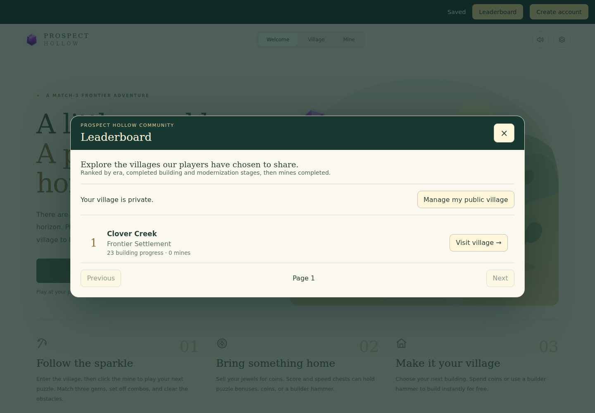
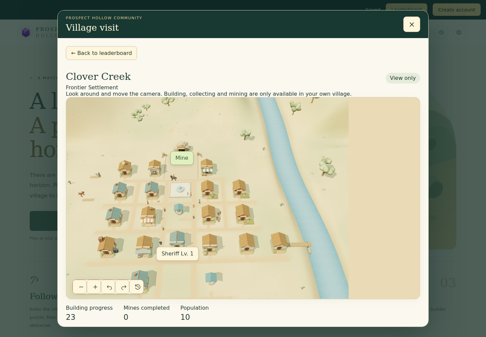
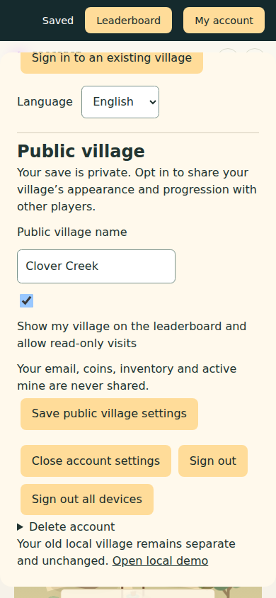
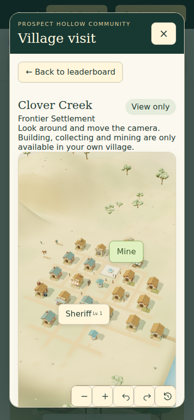
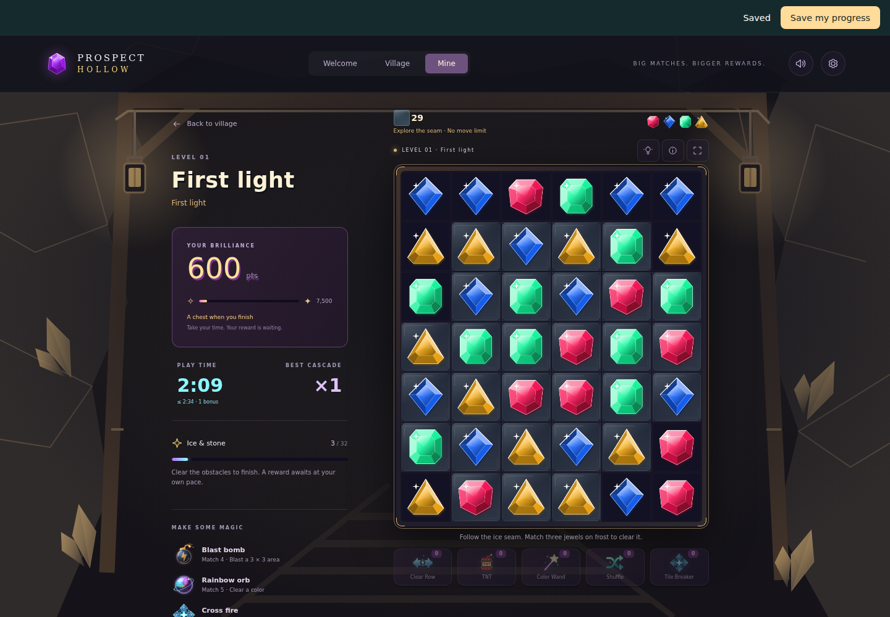
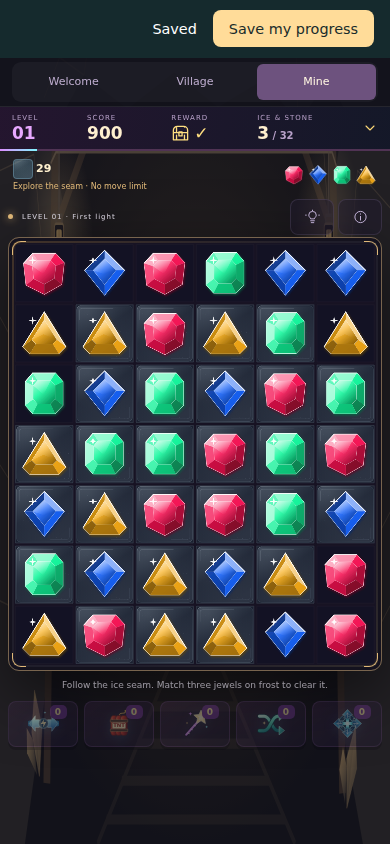
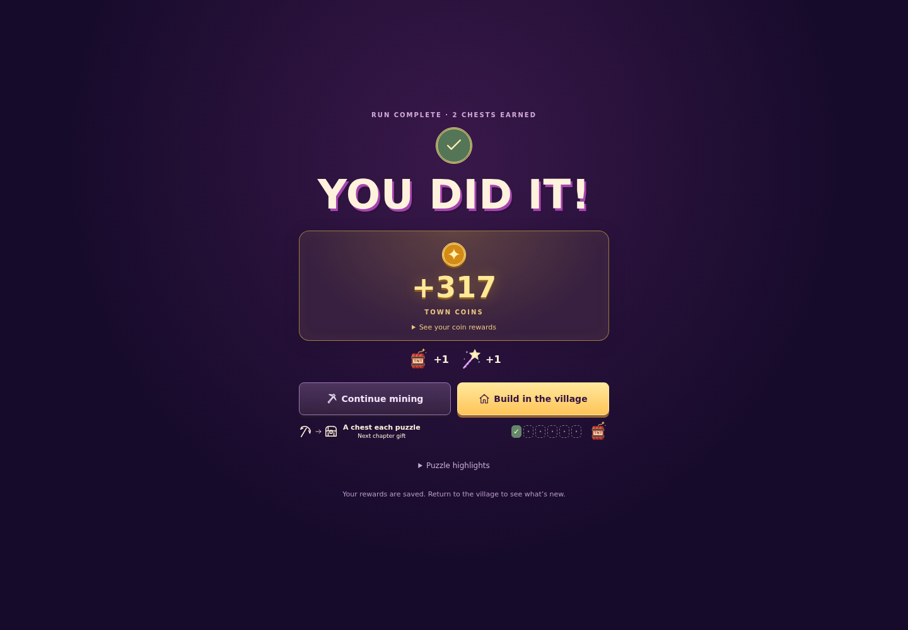
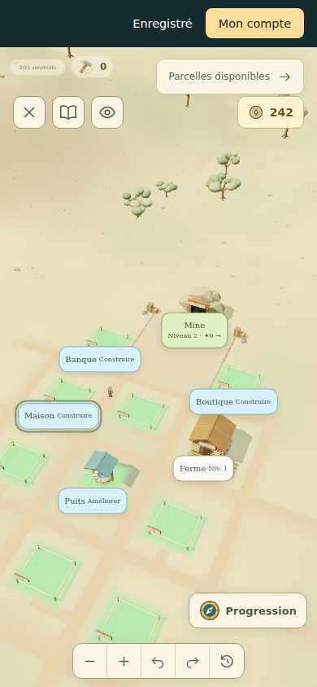

# Backend validation

Validated locally on 12 September 2026, based on game PR #37 revision `81966e3` (including PR #36). All backend edits use a separate worktree. The other rendering checkout remains untouched.

## Database benchmark — 12 September 2026

The [PostgreSQL/MySQL comparison](database-benchmark.md) exercises the real Apache API with identical synthetic data and equal database resource limits. All 72 trials passed: 18,432 measured requests and 9,216 warm-up requests, including exact mining move/revision and receipt/ledger checks. The report retains all trial ranges, CPU/memory measurements, image versions and the connection diagnostic. Results are mixed: MySQL usually leads read and town-action throughput; PostgreSQL uses much less database memory and has steadier mining results at concurrency 1 and 32. Shared-host contention limits production extrapolation. Benchmark containers, volumes, fake data, temporary dependencies and the newly downloaded load-generator image were removed afterward.

## Opt-in community follow-up — 12 September 2026

Accounts now expose explicit public village settings and a paginated leaderboard with read-only visits. Registration remains an emailed confirmation flow, with one private village per account. Existing accounts are not published by the schema upgrade.

- PostgreSQL 17 and MySQL 8.4 each pass 724 community assertions covering default privacy, linked-only opt-in, strict name/settings validation, public-field whitelisting, private-save/run ownership, forged interaction requests, server-derived ranking, construction/victory updates, pagination, opt-out and account deletion. Each also passes the 59 API integration requests and concurrency suite.
- An upgrade test starts from schema version 1, preserves an existing private profile and revision byte-for-byte, publishes no villages, and verifies repeatable CLI migration. Both databases pass. CI now runs this upgrade check and the community suite.
- All 1,051 frontend tests across 59 files pass. The final focused cloud/profile, public render-model and translation suite passes 30 tests after browser fixes. Formatting and the cloud production build pass.
- Separate Chromium sessions verify creating and confirming an account through local Mailpit, default-unchecked public settings, explicit opt-in with a chosen name, and a guest viewing the published village. A disposable database fixture supplies completed frontier buildings for appearance checks; it is not earned gameplay evidence.
- At 1440×1000, opening a visit, clicking buildings and dragging the camera leave the visitor's private campaign/game state unchanged, send zero write requests, and expose zero enabled building actions. Background private-profile polling and underlying town rendering pause during visits. With WebGL deliberately unavailable, the SVG fallback also blocks building/mine clicks with zero writes.
- At 390×844, account settings and village visits have no horizontal overflow. Opting out removes the listing; trying a previously cached visit returns 404. The desktop/mobile console has no application exception; expected initial guest 401 responses, the opt-out 404, software WebGL warnings and the deliberately forced fallback are accounted for.

Both databases are functionally validated; no equivalent production-load benchmark establishes that one is faster. No production deployment or hosted migration was performed.

## Authority and responsiveness follow-up — 12 September 2026

Merged `develop` at `ababf214` into the PR branch. The backend audit covered authentication and session revocation, save replacement, purchases, reward selection, puzzle completion, unlock eligibility, timestamps, command replay and concurrent mutations.

Fixed an economic bypass where withholding a raid acknowledgment prevented subsequent encounters and losses. All six eras now retain their five-victory cadence regardless of UI acknowledgment. Historical action receipts remain immutable; a stale acknowledgment cannot alter the latest encounter.

The frontend now starts reversible swap animation while the backend validates the move, rejects obvious mis-swaps locally, preserves the existing gem-bound input buffer, and pauses town income polling during mining. Failed requests restore the confirmed board. Account/session changes and newer snapshots cannot be overwritten by an older animation continuation.

Follow-up validation:

- PostgreSQL 17 and MySQL 8.4 each pass 59 API integration requests, 64 puzzle-service assertions, API unit checks, and concurrent purchase, replay, settlement and revocation checks. Forged save, reward, completion, board, price, timer, construction and unlock payloads leave the stored profile, revision and receipt count unchanged.
- 44,342 town-rule checks pass, including repeated unacknowledged encounters in every era. All 240 levels remain playable; 509 JavaScript evaluations and 267 full cascade comparisons pass.
- The final full frontend suite passes 1,050 tests across 58 files, including 36 cloud/responsiveness tests. The ordinary parallel run exceeded several default test timeouts on a busy shared host; reduced-concurrency verification uses `npx vitest run --maxWorkers=2 --testTimeout=30000`. Formatting and the cloud production build pass.
- Chromium at `http://localhost:5194`, with an isolated Apache/PostgreSQL backend: at 1440×1000, an actual pointer swipe starts its animation during an injected 800 ms request delay, while displayed score/moves remain at the previous confirmed values. Server cascades then advance the score from 300 to 600 and moves from one to two. This checks latency overlap, not a physical-device frame-rate guarantee.
- At 390×844, deliberately dropping the response **after** the server commits keeps the displayed board at two moves / 600 points. The visible Retry save button resends the identical action ID, recovering the exact server board at three moves / 900 points with no extra move or horizontal overflow. Reloading and resuming restores the same three moves / 900 points.
- Browser console inspection found only the expected initial unauthenticated profile request, deliberately aborted move request, and software WebGL performance warnings; no application exception occurred in the verified flows.

The earlier release validation below describes the original implementation and remains historical evidence. No production deployment or hosted database migration was performed during this follow-up.

## Automated checks

- `npm run verify`: 1,041 tests across 58 files, formatting and production build pass. The Docker build also compiles with `VITE_CLOUD=true`.
- Puzzle parity: all 240 authored levels are playable; 509 JavaScript evaluations and 267 complete cascade resolutions agree with PHP.
- Town parity: 44,240 checks across six eras and 48 buildings, including prices, city services, construction, modernization, inventory, rewards, income, bandits, workshop fires and storms. Full city matches 199 food, 194 water, 188 population and 100 happiness.
- PostgreSQL 17 and MySQL 8.4: API unit checks, 47 kernel integration requests, 64 puzzle-service assertions, and separate-process concurrent mutation checks pass. Duplicate commands return one receipt, concurrent spending cannot overspend, victory settles once, and revocation invalidates a command waiting on a lock.
- Real Apache HTTP: 16 requests verify authentication, Origin/Host, JSON/body limits, cookie/cache attributes, CSRF, replay, stale revisions, rejected imports and deletion.
- Client tests cover lost-response retry, durable queues, duplicate bootstrap, pending authentication expiry, account switching and cross-tab late responses.
- Composer audit and npm audit report no known vulnerabilities at validation time. Runtime Composer platform requirements pass on PHP 8.4.25.
- Local PostgreSQL dump restored into a separate database: all nine table counts and a known marker matched. This verified data restoration; it was not a hosted restore or a browser login against the restored database. Backup failure cleanup, unique filenames and mode 0600 were checked separately.

## Browser checks

Chromium used separate browser profiles at 1440×1000 and 390×844. The flow creates a guest, links email through local Mailpit, confirms explicitly, builds a well, wins level 1 through legal server-validated moves, receives 317 coins and two saved powers, and buys the 75-coin farm. The second browser signs into the existing email and recovers the same account, 242 coins, both buildings, the level record and inventory. French preference survives recovery.

After updating from the earlier four-era catalog to PR #37, the same account retains its balances and gains the nine new empty city plot keys. Level 2 starts on the desktop; using TNT is recorded once. The phone resumes the identical server board and run ID with score 600 and TNT quantity zero. The mobile page has no horizontal overflow. Account controls remain usable above the full-screen village.

The final flows have no application exceptions; the headless software WebGL renderer reports performance warnings. Earlier testing found and fixed an Apache root route, account-bar overlap and unnecessary background revision conflicts. Existing large JavaScript bundle warnings remain. This is browser functionality evidence, not physical-device GPU performance testing.

## Release limits

The FTP hosting account, public HTTPS/proxy configuration, real SMTP delivery, scheduled backups and hosted restoration have not been exercised. Follow [hosting instructions](hosting.md). No production deployment or database migration was performed. [Security scope](security.md) describes the remaining trust assumptions, rejected unverified local-save imports and unsupported native token transport. Passing checks is not a guarantee against every attack; production deployment still needs independent security review.
