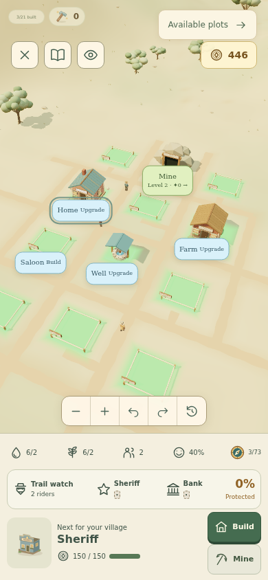
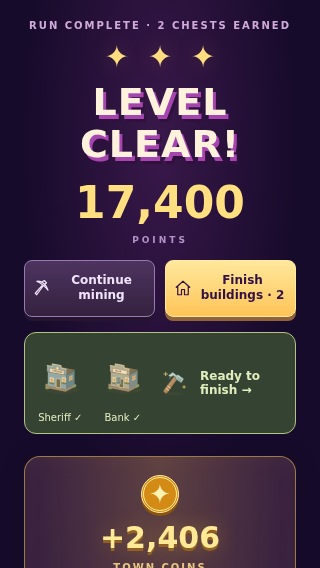
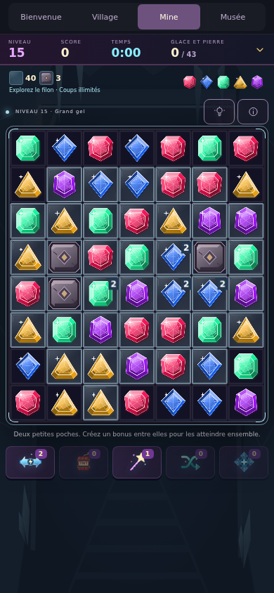
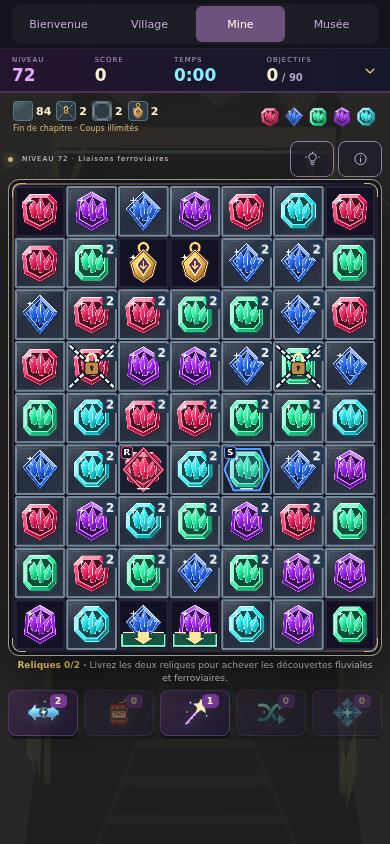

# Progression and visual UX review — 8 September 2026

> Historical review of the earlier 72-level checkout. The merged Electric era and fourth-era extension are covered in the [current Motor Age progression review](motor-age-progression.md). Measurements below describe that earlier build.

The main issues were hidden village guidance, text-heavy protection feedback, several unusually long mine runs, and River & Rail prices that no longer matched mining income. This pass changes the live game and preserves existing v3 progress, completed buildings, and already-paid projects.

The subsequent [casual progression pass](casual-progression.md) guarantees a completion reward, adds chapter gifts and daily village life, and shortens forge cycles. The measurements below describe the earlier mine/economy review.

## Findings and changes

| Finding                                                                 | Change                                                                                                                                                                                                                                                                           |
| ----------------------------------------------------------------------- | -------------------------------------------------------------------------------------------------------------------------------------------------------------------------------------------------------------------------------------------------------------------------------- |
| Full-screen village hid needs and construction guidance below the map.  | A permanent illustrated panel inside the village shows the next useful building, coin progress, ready construction, needs and era progress. Its buttons open the corresponding building or mine.                                                                                 |
| Early phone views framed lots of empty land.                            | The opening camera frames the mine, existing construction and next suggested plot. The directory and camera controls still provide access to other choices.                                                                                                                      |
| Players could build optional facilities before food, water or defenses. | Suggestions prioritize the first well/farm/home, unmet food or water demand, balanced sheriff/bank coverage, then useful services and affordable development. Construction remains concurrent. River & Rail suggests the bridge and new district before cosmetic modernizations. |
| Building benefits were mostly prose.                                    | Building cards show an icon and actual before → after service values. Construction has a prominent mine → hammer action. The first free instant build has one clear purchase action.                                                                                             |
| Raids arrived without a visible preparation cue.                        | The saved arrival creates a gentle warning during its final two puzzles. Sheriff and bank each have visible filled/empty coverage segments. During a raid, the panel shows the coin loss and actionable defenses.                                                                |
| Loss feedback looked more severe than its consequences.                 | A warmer, calmer loss notice links straight to protection. Losses remain capped at 30 coins and 10% of savings; the last 50 coins and buildings stay safe. No offline raids.                                                                                                     |
| Finished buildings competed with a prominent “continue mining” button.  | Ready construction promotes the village action and shows pictures of the buildings waiting to open. A direct finish action remains available in the village.                                                                                                                     |
| Chamber changes reused the same gem finish.                             | Three gem finishes—classic, cut and geode—vary between chapters. All retain the same matching colors and recognizable outer silhouettes. Bonus/relic identities stay distinct.                                                                                                   |
| Mine objectives relied on labels and combined counts.                   | Persistent illustrated counts show ice, stone, chains, seals and relics. Completed categories show a check. Obstacle introductions now include small match/clear or delivery diagrams.                                                                                           |
| Four late boards produced long outliers.                                | Opened awkward stone approaches and reduced one frozen obstruction; kept the established mechanics and relaxed move rules.                                                                                                                                                       |
| River & Rail could be bought out within a few visits.                   | New district prices now range from 2,400 to 3,900 coins. Modernizations cost 2,475 for supporting buildings or 2,925 for five-stage buildings. Previously paid 300-coin projects keep their original receipt and progress.                                                       |

## Mine measurements

Ran all **72 levels with 30 deterministic refill seeds each: 2,160 complete runs**, with the existing hint engine, earned board bonuses, free dead-board shuffles and no inventory powers. Before and after use the same seeds and the workspace's current match/bonus behavior.

| Chapter | Levels | Median moves | 90th percentile | Longest sampled | Median mining coins |
| ------- | ------ | -----------: | --------------: | --------------: | ------------------: |
| 1       | 1–6    |            9 |              12 |              17 |                 315 |
| 2       | 7–12   |           10 |              14 |              29 |                 666 |
| 3       | 13–18  |           13 |              22 |              43 |                 885 |
| 4       | 19–24  |           14 |              24 |              63 |               1,308 |
| 5       | 25–30  |           16 |              25 |              46 |               1,770 |
| 6       | 31–36  |           16 |              32 |              67 |               2,268 |
| 7       | 37–42  |           17 |              27 |              62 |               3,031 |
| 8       | 43–48  |           19 |              33 |              58 |               4,016 |
| 9       | 49–54  |           20 |              36 |              66 |               5,103 |
| 10      | 55–60  |           22 |              36 |              59 |               5,130 |
| 11      | 61–66  |           19 |              30 |              54 |               5,445 |
| 12      | 67–72  |           19 |              31 |              45 |               6,132 |

The chapter table uses the runner’s upper median for an even sample; individual level medians below average the middle pair. The opening median stays at 9 moves. Later chapters typically take 17–22 moves; the final level's median is 26. The fifth level of each chapter remains a lower-workload breather, and a fresh mechanic starts with a simpler layout. Difficulty is a rising overall curve with rests, rather than forcing every individual puzzle to be harder.

| Tuned level             | Previous longest | Revised longest | Revised median |
| ----------------------- | ---------------: | --------------: | -------------: |
| 34 · frozen chamber     |               76 |              67 |           21.5 |
| 38 · stone shelves      |               95 |              37 |           17.5 |
| 52 · sealed chambers    |               71 |              52 |             21 |
| 60 · three-relic finale |               81 |              58 |           26.5 |

All sampled runs complete. The first 12 levels need no dead-board shuffles. Five shuffles occur across chapter 7's 180 runs. The overall sampled maximum falls from 95 to 67 moves. These are hint-led engine measurements, not human completion times, and are not universal upper bounds. Unlimited moves let an unlucky run continue; score and speed remain optional chest goals.

Reproduce with `node scripts/measure-campaign.mjs . 30 72`. The script now reports real mining payouts through the shared economy functions, and village progression as well as move counts. The tuned late boards also receive 30-seed regression coverage.

## Village cadence

The economy simulation uses all 30 measured campaign paths, buys the suggested projects concurrently on each visit, finishes ready work, and uses the shortest saved raid interval. It excludes all chest rewards, builder hammers, passive income and capture bounties.

- Frontier completion: **32–37 normal puzzles**.
- Both available eras complete: **54–59 puzzles** with the new prices.
- Longest interval spent only saving, with no construction underway: **1–2 consecutive puzzles** across those paths.
- Total raid losses while following the defense suggestions: **0–20 coins** across each entire campaign.

Before the price change, a five-seed economy sample finished both eras at puzzles 40–42, only 4–6 puzzles after entering River & Rail. New prices extend useful village decisions while keeping individual purchases within a modest number of later mining payouts. Existing services remain active during modernization. Cosmetic modernizations are excluded from resource-shortage recommendations; the needs panel stops calling for capacity upgrades when none remain. The existing final water cap still limits occupancy, as described in [the era design](settlement-eras.md).

The two shipped eras are finite. Players with chest coins, hammers or accumulated offline earnings can complete them earlier, and the mine can outlast village construction. Extending building progression through every remaining puzzle should add new meaningful buildings/eras; this pass does not add mandatory grind or arbitrary mine gates to pad existing cosmetic work. After village completion, the museum, mine, shop, saloon and forge remain available.

## Design references

The useful reference from [Candy Crush's documented game modes](https://candycrush.zendesk.com/hc/en-us/articles/360000754897-Which-game-modes-will-I-find) is variation in visible goals: clearing, collecting, delivery and opening paths. Its [blocker guide](https://candycrush.zendesk.com/hc/en-us/articles/360000754717-Which-Blockers-can-I-find-in-the-game) also supports readable local obstacle interactions. [Royal Match's light bulb](https://dreamgames.helpshift.com/hc/en/3-royal-match/faq/378-light-bulb/) is another example of an obstacle responding to adjacent matches. These are design references, not numerical difficulty benchmarks. Crystal Cascade retains its own art, unlimited moves, non-spreading obstacles and gentle village consequences.

## Verification

`npm run verify` passes: formatting, **528 tests in 43 files**, and the production build. Tests cover progression suggestions, service previews, saved raid forecasts, bounded losses, preservation of older modernization receipts, all chapter art paths, and the existing gameplay/save/renderer checks. Vite still reports its existing large Phaser bundle advisory.

Verified the local Vite app in real Chromium at 1440×900, 390×844, 320×568 and 844×390. English and French, reduced motion and high contrast were included. Phone layouts stayed within the viewport; short landscape now gives objective icons priority over the decorative gem palette.

- Used real pointer swipes to complete levels 1, 13, 14 and 72, including the final level's chains, reinforced ice, colored seals and relic delivery. The 72-level coverage above is simulated, not a claim of manual play through every board.
- Built the free well and early services through their buttons. Completed construction through mining, checked the two-building completion prompt, and finished ready defenses from the raid controls.
- With a saved raid fixture, finished sheriff and bank construction during the encounter: visible loss changed **10 → 5 → 0 coins**, then the capture bounty was awarded once. A separate undefended fixture showed the softer loss notice; its protection button opened the sheriff's building card.
- Used the new panel's next-era action, completed the reduced-motion introduction and started the 2,400-coin post office project. Rechecked the final bridge-first suggestion and purchased the 3,600-coin bridge with its two-puzzle construction receipt. Existing services remained present.
- Checked classic, cut and geode art, including a cut → geode level change using the same live renderer. Checked objective counts and obstacle introductions against the actual board.
- No unhandled JavaScript errors or HTTP error responses were recorded in the final browser pass. Music requests cancelled when leaving the village, and Chromium reported GPU readback performance warnings in the software-rendered test environment.

This establishes functional and visual correctness in the tested cases. New-player sessions are still needed to measure hesitation, enjoyment and retention; a hint-led solver cannot establish those.

### Visual examples

| Village guidance                                                                                                          | Construction ready                                                                              |
| ------------------------------------------------------------------------------------------------------------------------- | ----------------------------------------------------------------------------------------------- |
|  |  |

| Cut gems in the middle mine                                                                              | Geode gems in the finale                                                                                 |
| -------------------------------------------------------------------------------------------------------- | -------------------------------------------------------------------------------------------------------- |
|  |  |
