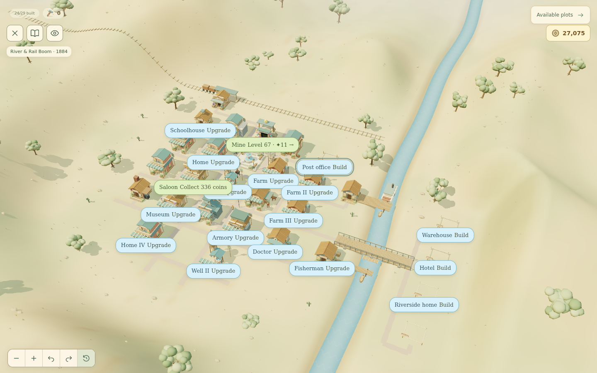
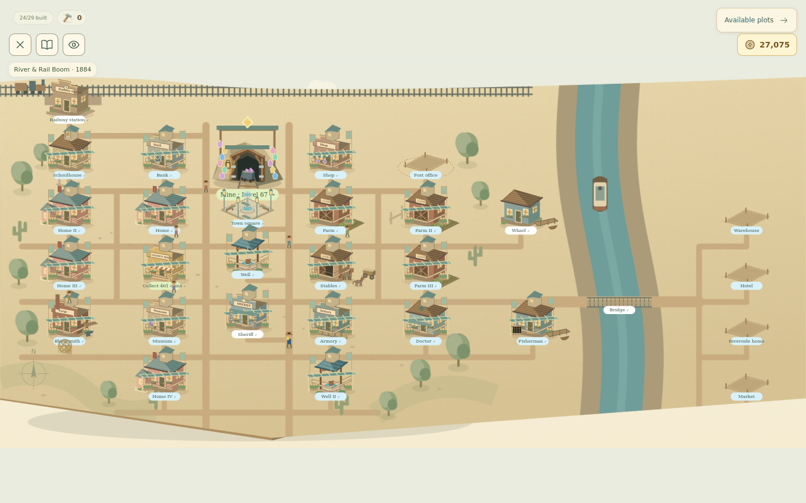

# Settlement eras: Frontier and River & Rail

Issue [#22](https://github.com/Starbugstone/Crystal-Cascade/issues/22) is an umbrella roadmap. This implementation makes only its first two eras playable. Industrial, Motor Age, Post-war and Contemporary remain disabled content entries. The issue contains the later station evolution and building ideas.

## Try the transition immediately

Run `npm run dev` and `npm run demo:eras`. The latter creates three local fixtures under the ignored `output/era-demo/` directory:

| Fixture               | Starting point                                                                                                                                    |
| --------------------- | ------------------------------------------------------------------------------------------------------------------------------------------------- |
| `frontier-ready`      | All 21 Frontier buildings at level 5, the River Discovery chapter completed, 30,000 coins and one Forge Charge. Advance the era from the village. |
| `river-rail`          | The saved transition story is pending; acknowledge it and build the station, bridge and wharf.                                                    |
| `river-rail-complete` | All 29 plots and all modernizations finished. Check the completed-era message, town activity and retained service levels.                         |

Use a **disposable browser profile** because importing a fixture replaces progress for that browser origin. Open the local game, open browser developer tools, and execute the matching `.console.js` file in the Console. Alternatively, in Application → Local Storage, set `crystal-cascade-profile-v3` to the contents of the matching `.json` file and reload. Enter the village from the welcome screen. These fixtures are developer files and are not bundled into the game.

Suggested test sequence:

1. Import `frontier-ready`. Choose **Advance to the next era**. Reload while the date card is open: it resumes the same transition. Choose **Explore the new era**.
2. From **Available plots**, build the **Railway station** for 975 coins. The station and railroad share one project. Complete two normal puzzles, then tap the ready station to finish it. Tracks and train activity appear together; there is no additional railroad payment.
3. Fund the **Bridge** (900 coins, two completions), **Wharf** (750 coins, one completion), and any 300-coin modernization. Work progresses concurrently. Finish the bridge to expose the warehouse, hotel, riverside home and market on the east bank.
4. Modernize a level-5 landmark. Its original service stays active during its two-completion project and remains unchanged when the new facade opens. Functional levels remain 5.
5. Enter a normal mine with the stored Forge Charge. Choose whether to keep or spend it. A spent charge provides one temporary puzzle Hammer ahead of persistent inventory; an unused temporary Hammer expires on victory, exit or reload.
6. Use `river-rail-complete` to check the final state. The later eras stay unavailable.

The first fixture leaves the Rail Connections chapter (levels 67–72) unfinished, so construction can be tested with new normal puzzles. Museum replay also advances work. Continuous play never advances construction, the era milestone or Forge Charge.

## Content and balance

- Four additional Frontier landmarks have five normal levels: fisherman (+1 food each, maximum 5), blacksmith, school (+1 happiness each, maximum 5), and doctor (civic/story service).
- The blacksmith earns one charge after five completed normal runs, only after its first construction has been finished. Upgrades do not accelerate charging. One charge is the storage limit; it never becomes a builder hammer, inventory item or overflow coins.
- The first era gate requires every Frontier plot at maximum level, no unfinished work, and the complete **River Discovery** chapter. The gate uses the chapter ID rather than a hard-coded level number. Two new six-level chapters extend the normal campaign to 72 levels.
- River & Rail introduces eight separate projects: bridge, wharf, station, post office, warehouse, hotel, riverside home and market. Station and hotel each add two visitor places; the new home adds ten resident places and market ten food. Food and water still constrain occupancy. The other projects add access, presentation and civic milestones.
- Modernizing existing plots costs 300 coins and two normal completions, with no extra service multiplier. Builder hammers can finish eligible new work or modernization immediately, following existing rules.
- A fully developed second era supports 50 residents and 10 visitors, capped by 60 water places. With 98% happiness and the existing base rate, saloon income is **1,188 coins/hour**. Collection and eight-hour storage remain unchanged.
- Existing bandit events and protection remain intact; River & Rail spaces new raid opportunities to ten normal completions instead of five.

## Persistence and rendering

The existing `crystal-cascade-profile-v3` key is unchanged. Missing era fields default to Frontier while preserving building levels, projects, coins, inventory, records, stock, income and raid receipts. Functional levels and `buildingEras` are separate. Era advancement saves its receipt before showing the date card and rolls back if saving fails. Forge spending is persisted before its transient Hammer is granted; transient runs never load back into inventory.

`eras.js`, `frontier.js`, `riverRail.js` and `campaignMilestones.js` hold content and gates. `TownEras` handles eligibility, modernization and normalization; the renderer modules under `game/town/buildings/` handle visual families. Existing plot positions remain stable. Shared layout metadata controls visible plots, SVG projection and permitted transport edges. The bridge exposes the east-bank route graph; the station lays a near-bank rail terminus that does not cross the river.

The river is carved into the existing deterministic landscape with a gradual valley and wet-bank vegetation exclusions. One lightweight water mesh animates separately from cached terrain. The fisherman, one steamboat and one train use the existing actor/motion lifecycle. Audio adds a quiet river loop and occasional procedural boat/train effects; sources are documented in the audio credits. New construction, modernization and transport details also appear in the SVG fallback. Reduced motion freezes ambient movement, and hidden/paused village state suspends town animation and audio.

## Verification

Regression coverage includes v3 migration, duplicate/stale completion receipts, bounded Forge storage and spending, a winning temporary Hammer preserving inventory, failed-save rollback, active-run transition blocking, modernization service preservation, joint station/rail completion, east-bank route permissions, bridge-deck movement, campaign playthroughs and audio lifecycle.

Real Chromium verification uses disposable saves to reach late-game states. Purchases, era advancement, the date card, construction finish and modernization are exercised through the UI; some completed-run receipts are supplied through the store to advance multi-puzzle construction without manually replaying an entire campaign. This checks the flow, while automated deterministic playthroughs cover all authored puzzles. It is not a manual balance playthrough of all 72 levels.

Browser checks ran at `http://127.0.0.1:5174/` in Chromium at 1440×900, 390×844, 320×568 and 844×390. They covered the saved transition across reload, station/rail completion, bridge and wharf, modernization, an actual Forge Hammer board click, French/high contrast/reduced motion, all 29 SVG plot controls and keyboard station selection. Instrumentation confirmed the same Three.js scene and town soundscape survive mine visits, with audio/motion stopped while hidden or in the Forge departure dialog. The fallback checks found no uncaught application errors or failed HTTP responses. Forced WebGL loss/restoration rendered successfully; subsequent development hot-reload teardown emitted WebGL resource deletion warnings.

